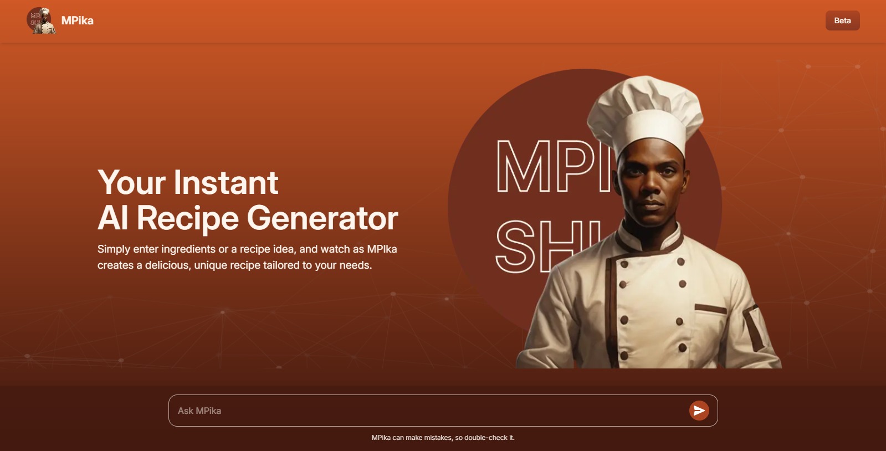
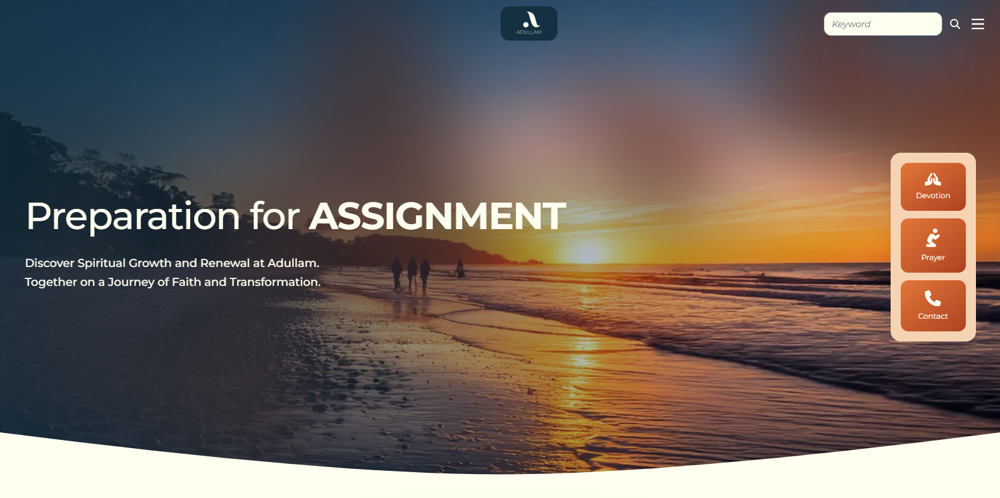
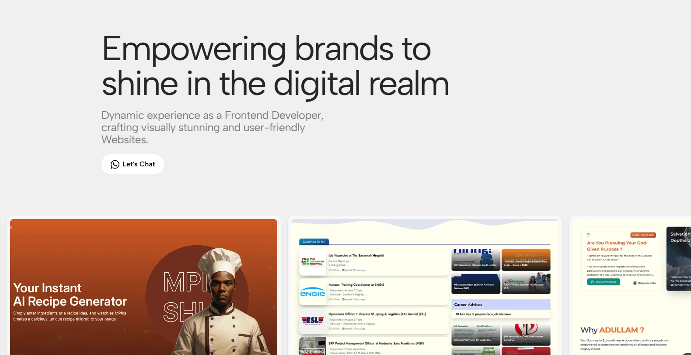

<h3 align="center">Hey You, Wassup, 👋 call me Poet</h3>

  

<h2 align="center">I Welcome You to my World of Design and Development.👻</h2>

  

<h3 align="center">Empowering brands to shine in the digital realm</h3>

<h4>Dynamic experience as a Frontend Developer, crafting visually stunning and user-friendly Websites.</h4>

<h2 align="center">Check Out My Cool Websites</h2>

### [MPika AI Recipe:](https://mpika.moreashan.com/)
- Users can type in a list of ingredients which are sent to an AI model, then returns a recipe suggestion.

  

#### Key Features:
- User Input for Ingredients: Users can type in a list of ingredients and submit the form.
- AI-Generated Recipe: The ingredients are sent as an array to an AI model, which returns a recipe suggestion.
- Dynamic Data Display: The application efficiently displays the AI-generated recipe using .map() to iterate over data.
- State Management: useState is utilized to manage form input and response data.
- Props Handling: Objects are passed as props between components, using object spreading for efficient data management.
- Conditional Rendering: Ternary operators are used to conditionally display content based on user input and AI response.
- React Forms: Implements controlled inputs and form submission handling in React.

### Technologies
- Next Js - server-side rendering and optimized performance
- Tailwind CSS - Styling for the UI
- React Hooks (useState) - Manage component state
- JavaScript ES6+ - Modern JavaScript syntax and features
- AI API Integration - Fetching AI-generated recipe data

### [Adullam:](https://adullam.moreashan.com/)
- Adullam is a dedicated Christian website designed to provide users with daily devotions, prayer points, and Bible verses. Built with a focus on performance and a clean, custom user experience, Adullam leverages the power of WordPress through tailored development.

  

#### Key Features:
- Custom User Interface (UI): A uniquely designed interface, crafted for intuitive navigation and a pleasant user experience.
- Categorized Post Display: Content is organized and displayed by categories (devotions, prayer points, Bible verses) for easy access.
- Social Media Integration: Enables users to easily share and connect with the content on social platforms.
- Responsive Layout: Ensures seamless viewing and interaction across various devices
- Custom Code Development: Emphasizes a hand-coded approach, avoiding drag-and-drop builders for optimal performance and control.

### Technologies
- WordPress (Custom Development): The foundation of the site, allowing for flexible content management and robust functionality.
- PHP: Used for server-side logic and custom feature implementation.
- Tailwind CSS: Employed for rapid and responsive front-end styling, ensuring a consistent and modern design.
- AOS (Animate On Scroll): Integrated to enhance user engagement with smooth, dynamic animations.

### [Opened Career:](https://openedcareer.com/)
- Opened Career is a job listing website designed to connect job seekers with opportunities, including full-time positions, remote work, and internships, from various companies and organizations. It aims to provide a user-friendly platform for discovering and applying to relevant career opportunities.

  

#### Key Features:
- Job Listing Display: Presents job opportunities in a clear, organized format, likely with filtering and search capabilities.
- Categorization: Jobs are categorized (e.g., by job type, location, industry) for easy browsing.
- Responsive Design: Adapts to different screen sizes for optimal viewing on desktops, tablets, and mobile devices.
- Search and Filtering: Allows users to refine job searches based on keywords, location, and other criteria.
- Company Profiles/Information: Potentially includes details about the companies posting jobs.
- Social Media Sharing: Enables users to share job listings on social media platforms.
- User Interface: A clean, modern UI designed for easy navigation and user experience.
- Remote Job Listings: Dedicated sections for remote work opportunities.
- Internship Listings: Dedicated sections for internship opportunities.

### Technologies
- WordPress (Custom Development): The foundation of the site, allowing for flexible content management and robust functionality.
- PHP: Essential for WordPress functionality and custom server-side logic.
- Tailwind CSS: Highly probable, considering the site's modern, utility-first styling approach.
- JavaScript: Used for interactive elements, dynamic content loading.
- AOS (Animate On Scroll): Integrated to enhance user engagement with smooth, dynamic animations.

## Thank You✨ for Stopping by!

Get to know more about me, Visit My Website - [Momanyi Brian Portfolio](https://momanyi-portfolio.vercel.app/)

  

- Lets fantasize something great!😊

## Useful Resources
- [Vector Logo](https://www.vectorlogo.zone/)
- [World Vector Logo](https://worldvectorlogo.com/)

<h3 align='center'>Bye Bye! 🎊 Don't be a Stranger!</h3>

  

