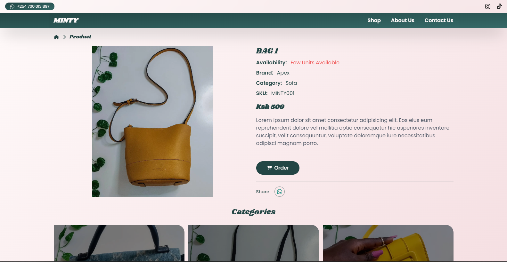

<h3 align="center">Hey You, Wassup, 👋 call me Poet</h3>

  

<h2 align="center">I Welcome You to my World of Design and Development.👻</h2>

  

<h3 align="left">Empowering brands to shine in the digital realm</h3>

<h4>Dynamic experience as a Frontend Developer, crafting visually stunning and user-friendly Websites.</h4>

<h2 align="center">Check Out My Cool Projects</h2>

### [MINTY E-Commerce Website:](https://minty-body-glamour.vercel.app/)
- Built with Vite + React for the frontend using Tailwind CSS. This responsive project allows a business to showcase their products and attract clients who can then order the products via WhatsApp message.

  

#### Key Features:
- Responsive Design: Ensured a consistent user experience across all devices with Tailwind CSS.
- SEO Optimization: Applied best practices for search engine optimization to enhance visibility.
- User Experience: Focused on creating an intuitive and engaging user interface.

## Thank You✨ for Stopping by! Kindly

- Visit My Website - [Momanyi Brian](https://momanyi.moreashan.com/) and lets fantasize something great!😊

## Useful Resources
- [Vector Logo](https://www.vectorlogo.zone/)
- [World Vector Logo](https://worldvectorlogo.com/)

<h3 align='center'>Bye Bye! 🎊 Don't be a Stranger!</h3>

  

